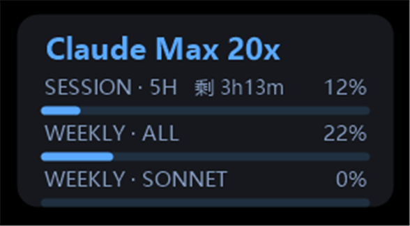

# ClaudeGauge

在 **Windows 桌面 / 任务栏**实时显示 **Claude Code** 的用量(会话 5 小时窗口、本周全部模型、本周 Sonnet),并对会话窗口显示重置倒计时。

> 第三方小工具,**非 Anthropic 官方产品**。作者:初见 · 公众号:初见即安宁

## 功能

- **两种形态**(右键菜单切换,记忆选择):
  - 悬浮窗:无边框圆角卡片,可拖动、置顶、调透明度
  - 任务栏:嵌进任务栏的精简一行(仅 Windows 10)
- **7 套配色主题**:红 / 橘黄 / 蓝 / 绿 / 墨绿 / 紫 / 橙黄(标题深、正文同色系浅)
- **倒计时**:会话窗口显示"剩 Xh Ym",每分钟刷新
- **系统托盘图标**:悬停看三项用量 + 重置时间;右键弹出全部设置
- 透明度可调、总是置顶、锁定位置、**开机自启**
- 套餐名自动识别(如 Claude Max 20x)

## 运行前提(重要)

Claude 的用量数据只能从 `claude` 命令行的 `/usage` 取得,所以需要:

1. **已安装 WSL**(Windows Subsystem for Linux)
2. WSL 里**已安装并登录** Claude Code(`claude` 命令行;登录是它本身的 OAuth)
3. **能联网**(国内通常需开代理,`/usage` 数据是实时向官方服务器查询的)

> Python 的 `pyte` 库会在首次运行时**自动安装**(国内自动用清华/阿里镜像,国外用官方源)。
> 本工具**不读取浏览器 cookie、不自己登录**,只是调用你已登录的 `claude` 命令行并读取本地凭据文件里的套餐等级字段。

## 使用

1. 下载本仓库(Code → Download ZIP),解压。
2. 保持 `ClaudeGauge.exe` 和 `cg_probe.py` **在同一个文件夹**。
3. 双击 `ClaudeGauge.exe`。
4. 在窗口或托盘"C"图标上**右键**进行设置。

## 系统支持

| | 悬浮窗模式 | 任务栏嵌入模式 |
|---|---|---|
| Windows 10 | ✅ | ✅ |
| Windows 11 | ✅ | ❌(Win11 任务栏架构不同) |

Win11 用户请使用悬浮窗模式。

## 原理

后台启动 WSL 里的 `claude`,自动执行 `/usage`,用伪终端 + `pyte` 把界面还原成文本并解析出三个百分比;套餐等级读 `~/.claude/.credentials.json` 的对应字段(不读 token)。

## 从源码编译

WSL 里:`sudo apt install -y mingw-w64`,然后 `bash build.sh`(用 mingw-w64 交叉编译为 Windows x64)。

## 鸣谢

[pyte](https://github.com/selectel/pyte) · [mingw-w64](https://www.mingw-w64.org/) · GDI+

## License

[MIT](LICENSE)
